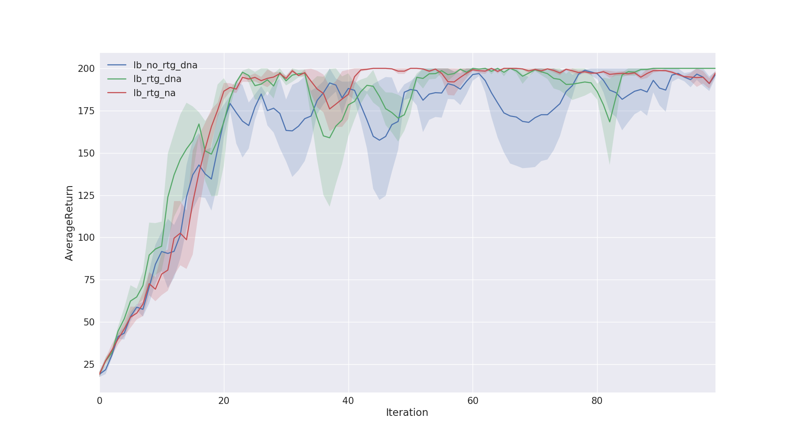
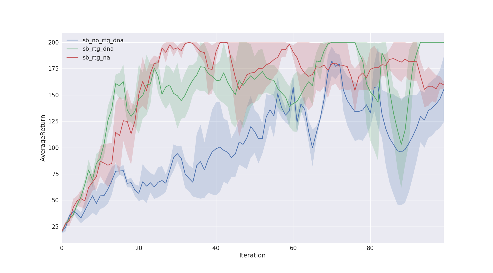
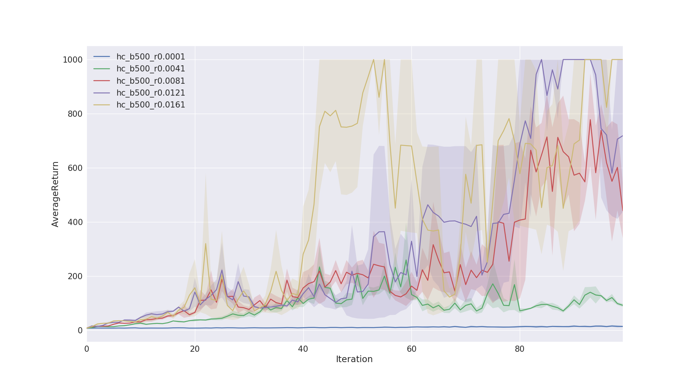

# CS294-112 HW 2: Policy Gradient

Modification:

In general, we followed the code structure of the original version and modified the neural network part to pytorch. 

Because of the different between the static graphs framework and the dynamic graphs framework, we merged and added some code in `train_pg_f18.py`. We also adapted the instructions of this assignment for pytorch. (Thanks to CS294-112 for offering  code for the instructions) And you can just follow the pytorch version instructions we wrote.

------

Dependencies:

 * Python **3.5**
 * Numpy version **1.14.5**
 * Pytorch version **0.4.0**
 * MuJoCo version **1.50** and mujoco-py **1.50.1.56**
 * OpenAI Gym version **0.10.5**
 * seaborn
 * Box2D==**2.3.2**

Before doing anything, first replace `gym/envs/box2d/lunar_lander.py` with the provided `lunar_lander.py` file.

The only file that you need to look at is `train_pg_f18.py`, which you will implement.

See the [HW2 PDF](./hw2_instructions.pdf) for further instructions.

## Problem 4

- Large batch


- Small batch


### Questions

1. Which gradient estimator has better performance without advantage-centering: the trajectory-centric one, the reward to go one.
   1. <font color="red">Answer</font>: The reward to go had a better performance. The blue line(no reward to go) took more iterations to reach average return of 200.
2. Did advantage centering help?
   1. <font color="red">Answer</font>: Comparing the green (no advantage centering) and the red(has advantage centering) shows that advantage centering does not have a significant improvement. Though this is against the typicall understanding of advantage centering.
3. Did batch size make an impact?
   1. <font color="red">Answer</font>: Larger batch size shows less variance in the trajectory performance.

## Problem 5

- By running grid search on batch and learning rate parameters, it was found that batch of 500 with learning rate of 0.016 can reach average return of 1000. Though the result is unstable and has high variance.

```bash
# running the grid search experiment
./problem_5.sh

# plot all result of grid search

./problem_5_plot.sh
```

- Result of the batch=500 is as below:

