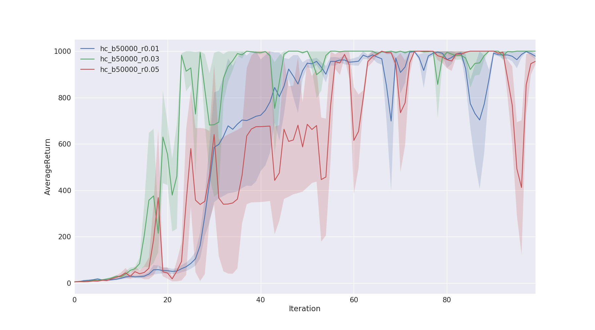

# CS294-112 HW 2: Policy Gradient

- CS294 Homework 2 Results with Pytorch, using starter code from  [berkeleydeeprlcourse-homework-pytorch](https://github.com/KuNyaa/berkeleydeeprlcourse-homework-pytorch)

## Problem 4: CartPole-v0

```bash
# running the grid search experiment
./problem_4.sh
```

- Large batch


- Small batch


### Questions

1. Which gradient estimator has better performance without advantage-centering: the trajectory-centric one, the reward to go one.
   1. <font color="red">Answer</font>: The reward to go had a better performance. The blue line(no reward to go) took more iterations to reach average return of 200.
2. Did advantage centering help?
   1. <font color="red">Answer</font>: Comparing the green (no advantage centering) and the red(has advantage centering) shows that advantage centering does not have a significant improvement. Though this is against the typicall understanding of advantage centering.
3. Did batch size make an impact?
   1. <font color="red">Answer</font>: Larger batch size shows less variance in the trajectory performance.

## Problem 5: Inverted Pendulum-v2

- By running grid search on batch and learning rate parameters, it was found that batch of 500 with learning rate of 0.016 can reach average return of 1000. Though the result is unstable and has high variance.

```bash
# running the grid search experiment
./problem_5.sh
```

- Result of the param space search is shown below, group by batch size.




## Problem 7: LunlarLancerContinuous-v2

```bash
# running the grid search experiment
./problem_7.sh
```


## Problem 8: HalfCheetah-v2

### Part 1: Grid Search

```bash
# running the grid search experiment
./problem_8_part1.sh
```


### Part 2: Optimum Param

```bash
# running the grid search experiment
./problem_8_part2.sh
```

